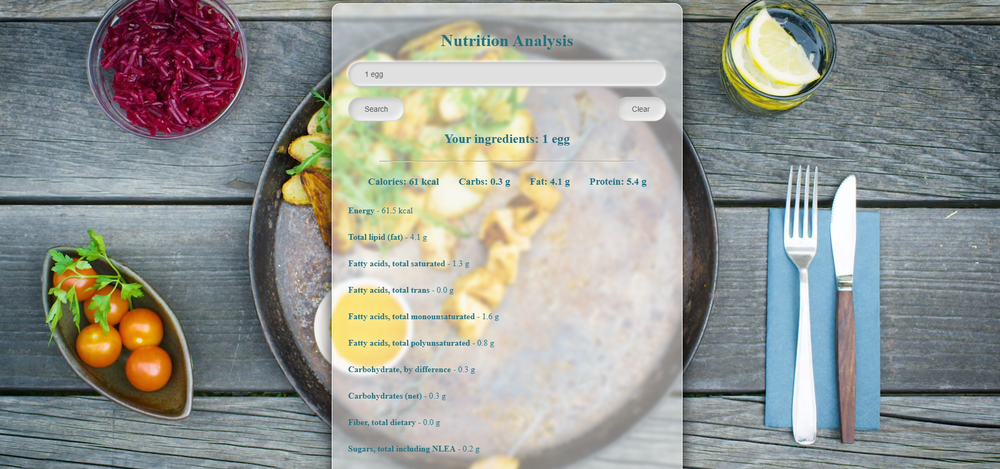

# Nutrition Analysis App

Diese App ermöglicht die Analyse der Nährwerte von Zutaten. Benutzer können eine Liste von Zutaten eingeben und erhalten detaillierte Nährwertinformationen wie Kalorien, Kohlenhydrate, Fette und Proteine. Die App verwendet die [Edamam API](https://developer.edamam.com/edamam-nutrition-api) zur Nährwertanalyse.

## 🚀 Demo

Try out the application here: [https://nutrition-analysis-serenityscript.netlify.app/](https://nutrition-analysis-serenityscript.netlify.app/)

## 📋 Features

- Eingabe von Zutaten und Nährwertanalyse
- Verwendung der [Edamam API](https://developer.edamam.com/edamam-nutrition-api)
- Adaptive und responsive Benutzeroberfläche (unterstützt mobile Geräte)
- Verwendung von Flexbox und Media Queries für responsives Design
- Nutzt **SweetAlert2** für ansprechende Benachrichtigungen
- Video-Hintergrund für visuelle Attraktivität

## 🛠️ Technologien

- **React** (Hooks: useState, useEffect)
- **CSS** für das Styling (inklusive Media Queries für Responsivität)
- **SweetAlert2** für Benachrichtigungen
- **Edamam Nutrition API** für die Nährwertanalyse

## 📦 Installation

1. **Repository klonen**:

  - git clone git clone https://github.com/SerenityScript/nutrition-analysis.git
  - cd nutrition-analysis-app

## Abhängigkeiten installieren:

Stelle sicher, dass Node.js und npm installiert sind. Führe dann folgenden Befehl aus:

npm install

## App starten:

npm start

Die App wird normalerweise unter http://localhost:3000/ im Browser geöffnet.

## ⚙️ Verwendung
Gib eine Liste von Zutaten im Textfeld ein (z. B. 1 Apfel, 1 Teelöffel Zucker).
Klicke auf den "Search" Button, um die Nährwertanalyse zu starten.
Die Nährwerte werden unterhalb des Eingabefeldes angezeigt.

## 📱 Responsives Design
Die App passt sich an verschiedene Bildschirmgrößen an und unterstützt sowohl mobile Geräte als auch Desktop-Bildschirme. Es wurden Flexbox und Media Queries verwendet, um sicherzustellen, dass die App auf unterschiedlichen Geräten optimal aussieht.

## 📄 Lizenz
Dieses Projekt ist unter der MIT License lizenziert. Siehe die LICENSE-Datei für weitere Details.

## 🔗 Nützliche Links
* Recipe Search API: https://www.edamam.com/
* React: https://reactjs.org/
* Create React App: https://create-react-app.dev/
* SweetAlert2 Dokumentation: https://sweetalert2.github.io/#usage/

## ✨ Mitwirkende
Yulia Siebrandt - Projektentwicklung

## 📧 Kontakt
Wenn du Fragen oder Vorschläge hast, melde dich gerne bei mir über [siebrandt.dev@gmail.com](mailto:siebrandt.dev@gmail.com)

